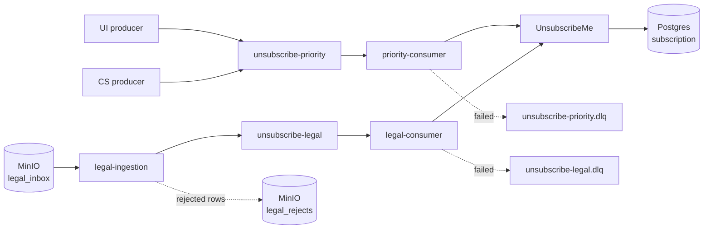

# Unsubscribe Platform

When a reader unsubscribes from a writer on a blogging platform, that request has
to reach an external subscription service quickly, and it has to survive
everything that can go wrong on the way: duplicate clicks, retries, malformed
input, an unavailable downstream service.

This repository implements that path end to end, locally, with three sources of
unsubscribe requests and one delivery guarantee that holds for all of them.

**The problem in one line:** the same business event arrives from three very
different places, with different volumes and different latency expectations, and
must end up applied exactly once in effect — never lost, never applied twice.

| Source | Shape | Latency expectation |
|---|---|---|
| Unsubscribe UI | continuous stream, one event per click | near real time |
| Customer Success | rare, an agent acting for the user | near real time |
| Legal | a CSV batch, up to millions of rows | best effort |

**Analytical plane: TBD.** Dashboards and ad-hoc analysis are out of scope for
now. The two Kafka topics are the intended entry point for them, which is why
events stay on the topics rather than existing only as database state.

---

## Architecture



**Why two topics.** UI and Customer Success need near-real-time delivery; a Legal
batch of a million rows does not. On a shared topic that batch would sit in front
of a fresh UI click and break its latency. Separate topics and separate consumer
groups give fault isolation (a poisoned Legal batch cannot stall the UI path),
independent scaling, and independent tuning.

**Why the business logic is shared.** The two consumers are the same image with
different environment variables. The delivery guarantee differs between the
paths; the meaning of "unsubscribe" does not.

**Where idempotency lives.** Not in Kafka, and not in the consumer: in
UnsubscribeMe's own database, as an UPSERT on `(user_id, writer_id)`. A repeat of
the same event, or an independent request from another source, converges to the
same row and preserves the first `unsubscribed_at`.

**Delivery semantics.** At-least-once, end to end. The final side effect is an
HTTP call to an external service, which no Kafka transaction can cover, so the
consumer commits its offset only after the call succeeds. A crash in between
replays one event into an idempotent endpoint; the reverse order could silently
drop a consent record.

Full reasoning, with the alternatives that were rejected, is in
[`docs/decisions.md`](docs/decisions.md).

---

## What is implemented

- **Event contract** — Avro schema in `libs/contracts/unsubscribe_event.avsc`,
  registered in Schema Registry with `BACKWARD` compatibility. A producer cannot
  publish an event that does not match the schema.
- **Message key** — `user_id:writer_id`, so all events for one subscription land
  in the same partition and are never processed concurrently.
- **Durability** — three brokers, `replication_factor=3`,
  `min.insync.replicas=2`, producers with `acks=all` and idempotence enabled.
- **Legal ingestion** — reads a CSV from object storage, validates row by row,
  publishes the valid rows, writes the rejected ones with a reason, moves the
  processed file aside, and is idempotent per file.
- **Failure handling** — bounded in-place retries with growing backoff, then a
  dead-letter topic per source topic. Permanently rejected and undecodable
  messages skip the retries and go straight to the DLQ.
- **Fault injection** — the producers can generate duplicates and garbage on
  demand; UnsubscribeMe can be told to fail or to be slow.

Not implemented: the analytical plane, and automated tests.

---

## Running it

**Prerequisites:** Docker with Compose, and [uv](https://docs.astral.sh/uv/).

Everything below runs from the repository root, in an ordinary terminal.

### 1. Start the infrastructure

```bash
docker compose -f infra/docker-compose.yml up -d --wait \
  kafka kafka-2 kafka-3 schema-registry postgres minio
```

This also runs two one-shot containers that exit when done: `minio-init` creates
the bucket, `db-migrate` applies the database schema.

### 2. Create the topics

Auto-creation is disabled on purpose. Topics are declared in
`infra/topics.yaml` and applied explicitly:

```bash
uv sync
uv run python tools/apply_topics.py
```

The script is idempotent: it creates what is missing, grows partition counts, and
refuses to change a replication factor on a live cluster, because that needs a
partition reassignment rather than a config edit.

### 3. Start the services

```bash
docker compose -f infra/docker-compose.yml up -d --wait \
  unsubscribeme priority-consumer legal-consumer kafka-ui

docker compose -f infra/docker-compose.yml up -d ui-producer cs-producer
```

The producers generate a continuous stream: UI at about 2 events per second,
Customer Success at about one every five seconds.

### 4. Run a Legal batch

```bash
uv run python tools/generate_legal_batch.py --rows 200 --broken-share 0.1
docker compose -f infra/docker-compose.yml --profile jobs run --rm legal-ingestion
```

The generator writes a CSV into the bucket; ingestion processes it once and
exits. Running it a second time on the same file produces no new events.

### 5. Stop

```bash
docker compose -f infra/docker-compose.yml down --remove-orphans
```

Add `-v` to also drop the volumes and start from an empty cluster next time.

---

## Where to look

| What | Where |
|---|---|
| Topics, partitions, messages, consumer lag | Kafka UI — http://localhost:8082 |
| Files in the Legal landing zone (bucket `tikblog-legal`, prefixes `legal_inbox/`, `legal_processed/`, `legal_rejects/`) | MinIO console — http://localhost:9001 (`tikblog` / `tikblog-local`) |
| Registered schemas | http://localhost:8081/subjects |
| Operational state | Postgres on `localhost:5432`, database `tikblog` |
| Service logs | `docker compose -f infra/docker-compose.yml logs -f <service>` |

Kafka UI decodes Avro through the registry, so messages are readable there. A
plain `kafka-console-consumer` shows binary, because every value starts with a
schema id.

### The same things from the terminal

Current state, by source:

```bash
docker compose -f infra/docker-compose.yml exec -T postgres \
  psql -U tikblog -d tikblog -c \
  "select unsubscribe_source, count(*) from subscription group by 1 order by 2 desc;"
```

Consumer lag:

```bash
docker compose -f infra/docker-compose.yml exec -T kafka \
  /opt/kafka/bin/kafka-consumer-groups.sh --bootstrap-server localhost:29092 \
  --describe --group unsubscribe-priority-consumer
```

Live delivery, one line per call:

```bash
docker compose -f infra/docker-compose.yml logs -f priority-consumer
```

Files in the bucket:

```bash
docker compose -f infra/docker-compose.yml exec -T minio \
  ls -R /data/tikblog-legal
```

---

## Seeing the guarantees hold

Every behaviour worth claiming can be reproduced here. All fault injection is off
by default, so the default run is a clean stream.

### Normal operation

```bash
docker compose -f infra/docker-compose.yml logs --tail=5 unsubscribeme
```

Each request produces two lines: the HTTP access log, and a business line with
`event_id`, `request_id`, `user_id`, `writer_id`, `source` and an `outcome`.

### Duplicates and idempotency

Restart the producers with duplicates enabled:

```bash
TECHNICAL_DUPLICATE_PROBABILITY=0.2 BUSINESS_DUPLICATE_PROBABILITY=0.1 \
  docker compose -f infra/docker-compose.yml up -d --force-recreate ui-producer cs-producer
```

`TECHNICAL_DUPLICATE_PROBABILITY` re-sends the identical event — a redelivery.
`BUSINESS_DUPLICATE_PROBABILITY` sends a new event for the same user and writer
from a different source — a person who unsubscribed in the UI and then asked
support to do it again.

Count how UnsubscribeMe answered:

```bash
docker compose -f infra/docker-compose.yml logs unsubscribeme \
  | grep -o '"outcome": *"[a-z_]*"' | sort | uniq -c
```

`created` is a new unsubscribe, `unchanged` is a repeat that changed nothing.
The second number is the guarantee: those events were delivered, accepted, and
had no effect.

The same fact from the database — rows whose state was rewritten after creation:

```bash
docker compose -f infra/docker-compose.yml exec -T postgres \
  psql -U tikblog -d tikblog -c \
  "select count(*) from subscription where updated_at > created_at + interval '2 seconds';"
```

Zero. A repeat does not even touch the row.

### Rejected rows from a Legal batch

```bash
uv run python tools/generate_legal_batch.py --rows 120 --broken-share 0.15 --name demo.csv
docker compose -f infra/docker-compose.yml --profile jobs run --rm legal-ingestion
```

The final log line reports `rows_read`, `events_sent` and `rows_rejected`, and
the numbers add up. The broken rows — empty user, missing writer, unparsable
date, wrong column count — never become events:

```bash
docker compose -f infra/docker-compose.yml exec -T minio \
  cat /data/tikblog-legal/legal_rejects/demo.csv.rejects.csv
```

Each line carries the source file, the line number, the raw row and the reason.
This is not the DLQ: these rows never reached Kafka. The file itself ends up in
`legal_processed/`, and a second run skips it.

### The dead-letter queue

Make UnsubscribeMe fail every request:

```bash
UNSUBSCRIBEME_FAILURE_RATE=1 \
  docker compose -f infra/docker-compose.yml up -d --force-recreate unsubscribeme
```

The consumer retries each event three times with a growing pause, then parks it:

```bash
docker compose -f infra/docker-compose.yml logs -f priority-consumer
```

Look for `unsubscribe_call_retry`, then `unsubscribe_retries_exhausted`, then
`message_parked_in_dlq`. The queue keeps moving — one unprocessable message does
not block what is behind it. Parked messages are in `unsubscribe-priority.dlq`
in Kafka UI, with headers explaining why: `dlq_reason`, `dlq_error`,
`dlq_attempts`, and the original topic, partition and offset.

This also exposes the honest limit of the design. With a total outage, three
attempts per event take about a second and a half, and then every event in the
topic is parked: the DLQ becomes a copy of the stream rather than a place for
exceptions. Bounded retries protect the queue from one bad message; they do not
protect it from a dead downstream. A production system needs a circuit breaker
here — after N consecutive failures, stop consuming altogether and wait for the
service to come back, instead of shovelling the whole topic into the DLQ. That
is deliberately not implemented, and it is the first thing to add.

Repair the service and the stream recovers on its own:

```bash
UNSUBSCRIBEME_FAILURE_RATE=0 \
  docker compose -f infra/docker-compose.yml up -d --force-recreate unsubscribeme
```

A poison pill takes a different path. Producing bytes that do not match the
schema at all:

```bash
GARBAGE_BYTES_PROBABILITY=0.05 \
  docker compose -f infra/docker-compose.yml up -d --force-recreate ui-producer
```

Those messages cannot be decoded however often they are re-read, so they skip the
retries entirely and go straight to the DLQ with `dlq_reason=deserialization_failed`,
byte for byte as they arrived.

### Workload isolation

Start a large Legal batch and watch the priority path stay unaffected:

```bash
uv run python tools/generate_legal_batch.py --rows 100000 --name big.csv
docker compose -f infra/docker-compose.yml --profile jobs run --rm legal-ingestion
```

Lag grows on `unsubscribe-legal` while `unsubscribe-priority` keeps up, because
the two paths share nothing but the business logic. Scaling the legal consumer
drains it faster, up to the partition count:

```bash
docker compose -f infra/docker-compose.yml up -d --scale legal-consumer=3 legal-consumer
```

---

## Configuration

No infrastructure constant is hard-coded. Everything is read from the environment
at startup; the defaults target the local Compose stack.

| Variable | Default | Effect |
|---|---|---|
| `KAFKA_REPLICATION_FACTOR` | `3` | replication for the cluster's internal topics |
| `KAFKA_MIN_IN_SYNC_REPLICAS` | `2` | how many replicas must confirm a write |
| `KAFKA_TOPIC_PARTITIONS` | `3` | default partition count |
| `UI_EVENTS_PER_SECOND` | `2` | UI producer rate |
| `CS_EVENTS_PER_SECOND` | `0.2` | Customer Success producer rate |
| `TECHNICAL_DUPLICATE_PROBABILITY` | `0` | resend the identical event |
| `BUSINESS_DUPLICATE_PROBABILITY` | `0` | same subscription from another source |
| `MEANINGLESS_EVENT_PROBABILITY` | `0` | schema-valid but nonsensical event |
| `GARBAGE_BYTES_PROBABILITY` | `0` | bytes that bypass the serializer |
| `CONSUMER_MAX_ATTEMPTS` | `3` | in-place retries before the DLQ |
| `UNSUBSCRIBEME_FAILURE_RATE` | `0` | share of requests answered with 503 |
| `UNSUBSCRIBEME_LATENCY_MS` | `0` | artificial delay per request |

Topic-level settings — partitions, replication factor, retention,
`min.insync.replicas` — live in `infra/topics.yaml`. Changing scale means editing
that file and re-running `tools/apply_topics.py`, not editing code.

---

## Repository layout

```text
services/
  event-producers/        UI and Customer Success event generators
  legal-ingestion/        CSV batch -> validated events (one run, then exit)
  unsubscribe-consumer/   Kafka -> UnsubscribeMe, retries and DLQ
  unsubscribeme/          stub of the external service, with its own database
libs/
  contracts/              Avro schema, event model, serialization
  tikblog_kafka/          producer, consumer, dead-letter producer
  tikblog_storage/        object storage access
  tikblog_runtime/        JSON logging, shutdown handling
infra/
  docker-compose.yml      the local stack
  topics.yaml             topic declarations
  migrations/             database schema
tools/                    apply topics, generate Legal batches
```

---

## Deliberate limitations

The local stack is an executable model of the design, not a production
deployment. Single-host brokers, plaintext listeners, passwords in Compose
defaults, and a stub standing in for a third-party service are all conscious
simplifications.

Three boundaries are drawn on purpose:

- **The event contract for UI and Customer Success is assumed.** Those services
  are expected to emit the canonical event; the schema registry enforces its
  shape, not its meaning. Legal is the exception — its file is parsed here, so
  its row-level validation is inside the boundary.
- **The reverse operation belongs elsewhere.** Unsubscribe is monotonic here;
  resubscription is another service's concern.
- **The analytical plane is not designed yet.** Both topics are the intended
  entry point, and the choice between "requests received" and "unsubscribes
  applied" as the source for reporting is still open.
- **There is no circuit breaker.** Retries are bounded per message, so a single
  unprocessable event cannot stall the queue. A downstream that is down for
  everyone is a different failure, and the current design answers it by parking
  everything — correct, but not what you want at three in the morning.
