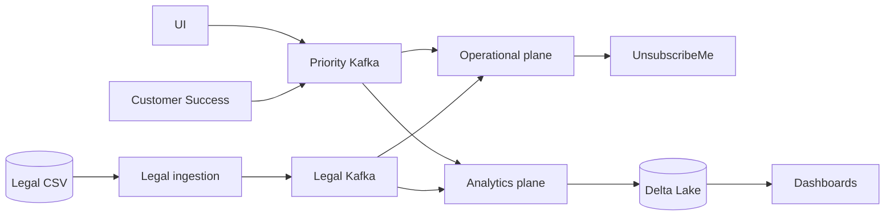
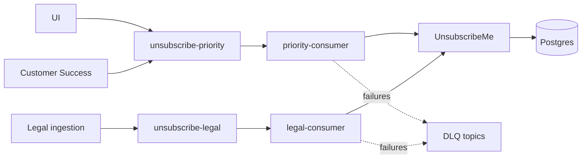
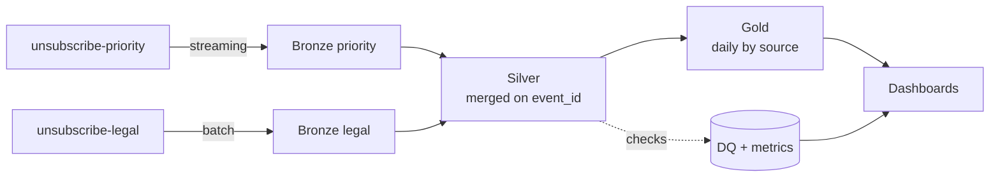

# Unsubscribe Platform

TikBlog is a blogging platform where readers subscribe to writers and can
unsubscribe again. Unsubscribe requests arrive from three sources:

- the reader-facing UI;
- Customer Success, acting on behalf of a reader;
- Legal, which submits unsubscribe requests in batches.

The platform has three requirements:

1. A UI unsubscribe must reach the external UnsubscribeMe service in near real time.
2. Unsubscribe activity must be available for management reporting and historical analysis.
3. The data must support ad-hoc analytical queries later on.

| Source | Shape | Latency expectation |
|---|---|---|
| Unsubscribe UI | continuous stream, one event per click | near real time |
| Customer Success | rare, an agent acting for the reader | near real time |
| Legal | a CSV batch, up to millions of rows | best effort |

This repository implements both planes: the operational unsubscribe path, and the
analytical platform built on the same events.

---

## High-level architecture

Two planes over one stream of events. The operational plane applies unsubscribes;
the analytical plane turns the same events into reporting.



Both planes run locally from one Compose stack.

---

## Operational plane

Three producers, two Kafka topics split by SLA, two deployments of the same
consumer, and one external service that applies the change.



The topics are split by latency expectation rather than by source, so a
million-row Legal batch cannot queue in front of a fresh UI click. Both consumers
run the same code and differ only in configuration.

Delivery is at-least-once: the terminal step is an HTTP call to an external
service, which no Kafka transaction can cover, so the consumer commits its offset
only after the call succeeds. Repeated delivery is safe because UnsubscribeMe
applies the change as an idempotent UPSERT keyed on the subscription, preserving
the moment of the first unsubscribe.

Failures are separated by whether a retry could help: transient ones get a few
bounded retries, permanent ones and undecodable bytes go straight to a
dead-letter topic. Either way the offset is committed, so one unprocessable
message cannot stall everything behind it.

**Full design and the rejected alternatives:**
[`docs/operational-design.md`](docs/operational-design.md)

---

## Analytics plane

Both Kafka topics feed it with their own offset state, kept in Spark checkpoints
rather than in Kafka consumer groups, so analytics never interferes with the
operational consumers. The priority topic is read by a
continuous Structured Streaming job; the Legal topic by a batch job that wakes
when new offsets appear, because a Legal batch may arrive in an hour or in a
month and does not justify a job running all the time.



Data lands in Delta Lake on the same MinIO: Bronze per topic, append-only, as it
arrived; one Silver table merged on `event_id`, which removes redeliveries while
keeping the same subscription arriving from different sources, since those are
distinct business events; a Gold daily mart by date and source with unsubscribe
counts and unique readers and writers.

Data-quality checks run inline with the transformations rather than as a separate
scan, and write to a monitoring table alongside pipeline latency metrics. Airflow
orchestrates the batch and maintenance jobs; Metabase serves the management,
data-quality and pipeline-health dashboards.

**Full design, including deduplication, DQ checks, orchestration, backfill and
schema evolution:** [`docs/analytics-design.md`](docs/analytics-design.md)

---

## Running locally

**Prerequisites:** Docker with Compose, and [uv](https://docs.astral.sh/uv/).

Everything below runs from the repository root, in an ordinary terminal.

### Fresh demo start

For a fresh demo, run the following sequence. The reset deletes existing local data.

```bash
./tools/reset_local.sh

UI_EVENTS_PER_SECOND=10 docker compose \
  -f infra/docker-compose.yml \
  -f infra/docker-compose.analytics.yml \
  up -d --wait

uv run python tools/generate_legal_batch.py --rows 500 --broken-share 0

docker compose \
  -f infra/docker-compose.yml \
  -f infra/docker-compose.analytics.yml \
  --profile jobs run --rm legal-ingestion
```

Wait up to approximately 5 minutes for the scheduled Gold refresh.

- Metabase: http://localhost:3000 — `demo@tikblog.local` / `Tikblog-demo-2026!`
- Airflow: http://localhost:8084 — `admin` / `admin-demo`
- Spark Structured Streaming UI: http://localhost:4041
- Kafka UI: http://localhost:8082
- MinIO: http://localhost:9001

No-login Metabase dashboard URLs are printed by `metabase-bootstrap`.

### 1. Start the infrastructure

```bash
docker compose -f infra/docker-compose.yml up -d --wait \
  kafka kafka-2 kafka-3 schema-registry postgres minio
```

The one-shot `db-migrate` applies the database schema when UnsubscribeMe starts
in step 3. `minio-init` creates the Legal bucket with the full stack in step 4,
or when running Legal ingestion.

### 2. Create the topics

Auto-creation is disabled on purpose. Topics are declared in `infra/topics.yaml`
and applied explicitly:

```bash
uv sync
uv run python tools/apply_topics.py
```

The script is idempotent: it creates what is missing, grows partition counts, and
refuses to change a replication factor on a live cluster, because that needs a
partition reassignment rather than a config edit.

### 3. Start the services

```bash
docker compose -f infra/docker-compose.yml up -d --wait \
  unsubscribeme priority-consumer legal-consumer kafka-ui

docker compose -f infra/docker-compose.yml up -d ui-producer cs-producer
```

The producers generate a continuous stream: UI at 100 events per second,
Customer Success at 1 per second. Both rates are environment variables
(`UI_EVENTS_PER_SECOND`, `CS_EVENTS_PER_SECOND`) — lower them if the stream
scrolls past faster than you can read it.

### 4. Start the analytics stack

```bash
docker compose \
  -f infra/docker-compose.yml \
  -f infra/docker-compose.analytics.yml \
  up -d --wait
```

This brings up Spark (master, workers, the long-running driver and a Spark SQL
endpoint), Airflow (webserver, scheduler, triggerer) and Metabase, creates the
`tikblog-analytics` bucket, registers the Delta tables and provisions the three
dashboards. The two priority streams — Kafka to Bronze and Bronze to Silver —
start with the driver and keep running; Airflow only handles Legal, the Gold
refresh, housekeeping and backfill.

### 5. Stop

```bash
docker compose \
  -f infra/docker-compose.yml \
  -f infra/docker-compose.analytics.yml \
  down --remove-orphans
```

Add `-v` to also drop the volumes and start from an empty cluster next time.

---

## Where to look

| What | Where |
|---|---|
| Topics, partitions, messages, consumer lag | Kafka UI — http://localhost:8082 |
| Legal files: bucket `tikblog-legal`, prefixes `legal_inbox/`, `legal_processed/`, `legal_rejects/` | MinIO console — http://localhost:9001 (`tikblog` / `tikblog-local`) |
| Registered schemas | http://localhost:8081/subjects |
| Operational state | Postgres on `localhost:5432`, database `tikblog` |
| Service logs | `docker compose -f infra/docker-compose.yml logs -f <service>` |
| Metabase application (login required) | http://localhost:3000 — `demo@tikblog.local` / `Tikblog-demo-2026!` |
| Demo dashboards (no login) | `/public/dashboard/<uuid>` URLs printed by `metabase-bootstrap` |
| DAG runs, the deferred Legal sensor, task failures | Airflow UI — http://localhost:8084 |
| Streaming queries, stages, executors | Spark master UI — http://localhost:8083, driver UI — http://localhost:4041 |
| Ad-hoc SQL over Bronze, Silver, Gold and monitoring tables | Spark SQL (Thrift) on `localhost:10000` |
| Delta tables | MinIO bucket `tikblog-analytics` |

Kafka UI decodes Avro through the registry, so messages are readable there. A
plain `kafka-console-consumer` shows binary, because every value starts with a
schema id.

The same things from the terminal — current state by source, consumer lag, live
deliveries, files in the bucket:

```bash
docker compose -f infra/docker-compose.yml exec -T postgres \
  psql -U tikblog -d tikblog -c \
  "select unsubscribe_source, count(*) from subscription group by 1 order by 2 desc;"

docker compose -f infra/docker-compose.yml exec -T kafka \
  /opt/kafka/bin/kafka-consumer-groups.sh --bootstrap-server localhost:29092 \
  --describe --group unsubscribe-priority-consumer

docker compose -f infra/docker-compose.yml logs -f priority-consumer

docker compose -f infra/docker-compose.yml exec -T minio ls -R /data/tikblog-legal
```

---

## Demo walkthrough

One unsubscribe, followed from the click to the report. Fault injection is off by
default, except for a small share of technical duplicates (0.1%), which keeps the
default run realistic without making it noisy.

### 1. Generate traffic from all three sources

UI and Customer Success produce continuously once started (step 3 above). Legal
arrives as a file:

```bash
uv run python tools/generate_legal_batch.py --rows 200 --broken-share 0.1
docker compose -f infra/docker-compose.yml --profile jobs run --rm legal-ingestion
```

The generator writes a CSV into the bucket; ingestion processes it once and
exits. The final log line reports `rows_read`, `events_sent` and `rows_rejected`,
and the numbers add up.

### 2. Follow the operational path

In Kafka UI both topics are filling; the priority consumer group shows its lag.
In the logs, each request produces an access line and a business line with
`event_id`, `request_id`, `user_id`, `writer_id`, `source` and an `outcome`:

```bash
docker compose -f infra/docker-compose.yml logs --tail=5 unsubscribeme
```

The result lands in Postgres, split by source — UI dominates, Customer Success is
rare, Legal appears in batches.

### 3. Send duplicates and watch nothing change

```bash
TECHNICAL_DUPLICATE_PROBABILITY=0.2 \
  docker compose -f infra/docker-compose.yml up -d --force-recreate ui-producer cs-producer

docker compose -f infra/docker-compose.yml logs unsubscribeme \
  | grep -o '"outcome": *"[a-z_]*"' | sort | uniq -c
```

`created` is a new unsubscribe; `unchanged` confirms that a duplicate was
accepted without changing the subscription state. The same fact from the
database — rows whose state was rewritten after creation:

```bash
docker compose -f infra/docker-compose.yml exec -T postgres \
  psql -U tikblog -d tikblog -c \
  "select count(*) from subscription where updated_at > created_at + interval '2 seconds';"
```

Zero. A repeat does not even touch the row.

### 4. Look at the rows Legal got wrong

```bash
uv run python tools/generate_legal_batch.py --rows 120 --broken-share 0.15 --name demo.csv
docker compose -f infra/docker-compose.yml --profile jobs run --rm legal-ingestion

docker compose -f infra/docker-compose.yml exec -T minio \
  cat /data/tikblog-legal/legal_rejects/demo.csv.rejects.csv
```

Each line carries the source file, the line number, the raw row and the reason.
These rows never reached Kafka, which is what separates a reject from a
dead-lettered message. The file itself ends up in `legal_processed/`, and a
second run skips it.

### 5. Break the downstream service

```bash
UNSUBSCRIBEME_FAILURE_RATE=1 \
  docker compose -f infra/docker-compose.yml up -d --force-recreate unsubscribeme

docker compose -f infra/docker-compose.yml logs -f priority-consumer
```

Look for `unsubscribe_call_retry`, then `unsubscribe_retries_exhausted`, then
`message_parked_in_dlq`. The queue keeps moving. Parked messages are in
`unsubscribe-priority.dlq` in Kafka UI, with headers explaining why:
`dlq_reason`, `dlq_error`, `dlq_attempts`, and the original topic, partition and
offset.

This also shows a limitation of the current design: with a total outage, every
event ends up parked and the DLQ becomes a copy of the stream. Bounded retries
protect the queue from one bad message, not from a dead downstream — that needs a
circuit breaker, which is deliberately not implemented.

Repair the service and the stream recovers on its own:

```bash
UNSUBSCRIBEME_FAILURE_RATE=0 \
  docker compose -f infra/docker-compose.yml up -d --force-recreate unsubscribeme
```

A poison pill takes a different path — bytes that do not match the schema at all
cannot be decoded however often they are re-read, so they skip the retries and go
straight to the DLQ with `dlq_reason=deserialization_failed`:

```bash
GARBAGE_BYTES_PROBABILITY=0.05 \
  docker compose -f infra/docker-compose.yml up -d --force-recreate ui-producer
```

### 6. Overload the Legal path and watch the UI path ignore it

```bash
uv run python tools/generate_legal_batch.py --rows 100000 --name big.csv
docker compose -f infra/docker-compose.yml --profile jobs run --rm legal-ingestion
```

Lag grows on `unsubscribe-legal` while `unsubscribe-priority` keeps up. Scaling
the legal consumer drains it faster, up to the partition count:

```bash
docker compose -f infra/docker-compose.yml up -d --scale legal-consumer=3 legal-consumer
```

### 7. Follow the same events into analytics

The same events are already flowing into Delta. Query them through the Spark SQL
endpoint (any client on `localhost:10000`, or the Metabase native editor):

```sql
select count(*) from bronze.unsubscribe_priority;
select count(*) from silver.unsubscribe_events;
select * from gold.unsubscribe_daily order by event_date desc, source;
```

Bronze holds every message as it arrived, duplicates included. Silver is merged
on `event_id`, so a redelivery leaves one row — while the same reader and writer
arriving from UI, Customer Success and Legal stay as three rows, because those
are three separate requests:

```sql
select count(*) as bronze_rows,
       count(distinct event_id) as distinct_events
from bronze.unsubscribe_priority;

select user_id, writer_id, count(*) as requests,
       collect_set(source) as sources
from silver.unsubscribe_events
group by user_id, writer_id
having count(*) > 1
limit 10;
```

### 8. Watch a data-quality failure land

Turn on the nonsensical-event injection — empty `user_id`, `requested_at` in the
future:

```bash
MEANINGLESS_EVENT_PROBABILITY=0.05 \
  docker compose -f infra/docker-compose.yml up -d --force-recreate ui-producer
```

Those rows reach Bronze, are rejected by the inline checks before Silver, and end
up in quarantine with the reason attached:

```sql
select failed_checks, count(*) from monitoring.dq_quarantine group by 1;
select layer, check_name, status, failed_rows
from monitoring.dq_results order by checked_at desc limit 20;
```

The Data Quality dashboard in Metabase turns yellow or red, and a row appears in
`monitoring.alert_events`. Nothing is sent anywhere — the alerting is a stub on
purpose.

### 9. Open Airflow and Metabase

In the Airflow UI (http://localhost:8084) the Legal DAG sits deferred on its
sensor until a Legal batch arrives, then runs Kafka → Bronze → Silver and exits;
the Gold refresh runs every five minutes; housekeeping is daily and can be
triggered by hand; backfill takes `layer`, `from_date` and `to_date` as
parameters.

The Metabase application at http://localhost:3000 requires login with
`demo@tikblog.local` / `Tikblog-demo-2026!`. The three dashboards are provisioned:
management activity from Gold, data quality from the monitoring tables, and
pipeline health with end-to-end and processing latency, Kafka lag, microbatch
duration and Gold freshness, each with a green / yellow / red status.

For the no-login demo, open the `/public/dashboard/<uuid>` URLs printed by
`metabase-bootstrap` for Management, Data Quality and Pipeline Health. Retrieve
them from the bootstrap logs:

```bash
docker compose \
  -f infra/docker-compose.yml \
  -f infra/docker-compose.analytics.yml \
  logs metabase-bootstrap
```

### 10. Prove late data is handled

Generate a Legal batch dated in the past, run ingestion, and watch the Gold
refresh rebuild that historical date rather than only today — the job derives the
dates to recalculate from the Silver rows it just processed, not from the clock.
The same effect is reachable on demand through the backfill DAG with
`layer=gold`.

---

## Configuration

No infrastructure constant is hard-coded. Everything is read from the environment
at startup; the defaults target the local Compose stack.

| Variable | Default | Effect |
|---|---|---|
| `KAFKA_REPLICATION_FACTOR` | `3` | replication for the cluster's internal topics |
| `KAFKA_MIN_IN_SYNC_REPLICAS` | `2` | how many replicas must confirm a write |
| `KAFKA_TOPIC_PARTITIONS` | `3` | default partition count |
| `UI_EVENTS_PER_SECOND` | `100` | UI producer rate |
| `CS_EVENTS_PER_SECOND` | `1` | Customer Success producer rate |
| `TECHNICAL_DUPLICATE_PROBABILITY` | `0.001` | resend the identical event |
| `MEANINGLESS_EVENT_PROBABILITY` | `0` | schema-valid but nonsensical event |
| `GARBAGE_BYTES_PROBABILITY` | `0` | bytes that bypass the serializer |
| `CONSUMER_MAX_ATTEMPTS` | `3` | in-place retries before the DLQ |
| `UNSUBSCRIBEME_FAILURE_RATE` | `0` | share of requests answered with 503 |
| `UNSUBSCRIBEME_LATENCY_MS` | `0` | artificial delay per request |

Topic-level settings — partitions, replication factor, retention,
`min.insync.replicas` — live in `infra/topics.yaml`. Changing scale means editing
that file and re-running `tools/apply_topics.py`, not editing code.

---

## Repository layout

```text
services/
  event-producers/        UI and Customer Success event generators
  legal-ingestion/        CSV batch -> validated events (one run, then exit)
  unsubscribe-consumer/   Kafka -> UnsubscribeMe, retries and DLQ
  unsubscribeme/          stub of the external service, with its own database
libs/
  contracts/              Avro schema, event model, serialization
  tikblog_kafka/          producer, consumer, dead-letter producer
  tikblog_storage/        object storage access
  tikblog_runtime/        JSON logging, shutdown handling
infra/
  docker-compose.yml      the local stack
  topics.yaml             topic declarations
  migrations/             database schema
analytics/
  common/                 Spark session, config, DQ, metrics, alerts, Delta helpers
  jobs/                   streams, Gold refresh, housekeeping, backfill
  sql/                    table registration for the SQL endpoint
airflow/dags/             four DAGs: Legal ingestion, Gold refresh, housekeeping, backfill
metabase/                 dashboard bootstrap and the queries behind it
config/                   analytics settings and monitoring thresholds
tools/                    apply topics, generate Legal batches
docs/                     design documents and decisions
```

---

## Deliberate limitations

The local stack is an executable model of the design, not a production
deployment. Single-host brokers, plaintext listeners, passwords in Compose
defaults, and a stub standing in for a third-party service are all conscious
simplifications.

Key boundaries are drawn on purpose:

- **The event contract for UI and Customer Success is assumed.** Those services
  are expected to emit the canonical event; the schema registry enforces its
  shape, not its meaning. Legal is the exception — its file is parsed here, so
  its row-level validation is inside the boundary.
- **The reverse operation belongs elsewhere.** Unsubscribe is monotonic here;
  resubscription is another service's concern.
- **There is no circuit breaker.** Retries are bounded per message, so a single
  unprocessable event cannot stall the queue. A downstream that is down for
  everyone is a different failure, and the current design answers it by parking
  everything.
- **Analytics reports requests, not confirmed unsubscribes.** It reads the same
  request topics as the operational consumers, so a request that ended in the DLQ
  still counts. Reporting on applied unsubscribes would need a separate result
  event from UnsubscribeMe.
- **No alerting infrastructure.** Threshold breaches are written to
  `monitoring.alert_events` and logged; nothing is sent anywhere.
