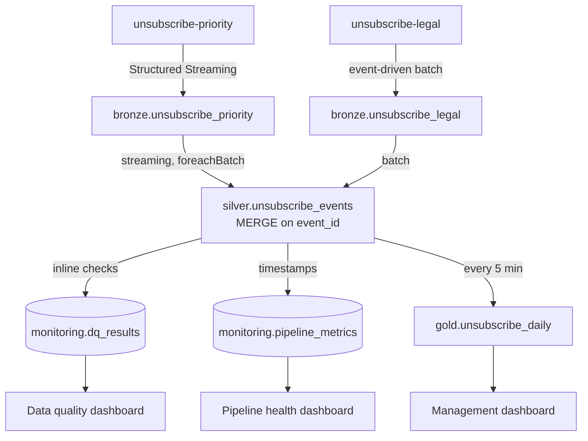

# Analytics Plane — Design

This document captures the detailed design of the implemented analytics plane.

The operational plane applies unsubscribes. This plane turns the same events
into reportable data: a management dashboard and ad-hoc historical analysis.

---

## 1. Requirements

**Management dashboard** — unsubscribe counts by source (`UI`, `CUSTOMER_SUCCESS`,
`LEGAL`), by date, with unique readers and unique writers.

**Ad-hoc analysis** — historical unsubscribe events, queryable without a new
pipeline for every question.

Dashboard freshness for the demo: about 5 minutes. That number is chosen so the
refresh is visible while demonstrating the system, not derived from a business
SLA. In production the interval follows the real reporting requirement and the
job's runtime.

---

## 2. Storage and engines

Object storage is the MinIO instance the operational plane already uses, in a
separate `tikblog-analytics` bucket:

```text
tikblog-analytics/
  bronze/
  silver/
  gold/
  monitoring/
```

Tables are Delta Lake (OSS). Processing is plain Apache Spark with Delta — no
Databricks. For the demo a small Spark cluster (roughly three workers) is enough;
sizing stays configurable rather than hard-coded.

---

## 3. Sources

Both Kafka topics feed analytics, with different processing shapes:

| Topic | Contents | Processing |
|---|---|---|
| `unsubscribe-priority` | UI + Customer Success | continuous Structured Streaming |
| `unsubscribe-legal` | Legal | event-driven batch job |

Analytics keeps its own offset state and does not affect the operational
consumers. That state lives in Spark checkpoints, not in a Kafka consumer group:
the Structured Streaming Kafka source manages consumed offsets internally and
does not commit them back to Kafka. Analytics lag is therefore measured as
`latest Kafka offset - offset processed by Spark`, read from the streaming
query's progress, not from `kafka-consumer-groups.sh`.

**Why Legal is read from Kafka rather than from the original CSV.** The CSV is
already in MinIO, but the operational Legal ingestion is what parses, validates
and normalises it into canonical events. Reading the raw file again would mean
reimplementing that logic and letting the two copies drift. Kafka already holds
the normalised result.

**Why Legal is batch rather than streaming.** A Legal batch may arrive in an hour
or in a month. Keeping a job alive for it wastes compute, so it runs when new
offsets appear and exits when they are consumed.

**How the Legal job knows where it stopped.** It is a Structured Streaming query
with `Trigger.AvailableNow` and a persistent checkpoint: it processes everything
available in the topic and terminates. The semantics stay batch and event-driven
— no long-running compute — while offset tracking is Spark's job rather than
ours. The alternative, a plain batch job storing last processed offsets per
partition in a control table, means writing and testing that bookkeeping by hand
for no gain here.

---

## 4. Bronze

Two append-only Delta tables, one per topic:

```text
bronze.unsubscribe_priority
bronze.unsubscribe_legal
```

The event is stored as it arrived — `event_id`, `user_id`, `writer_id`, `source`,
`requested_at`, `request_id`, `cs_agent_id`, `legal_batch_id` — plus technical
metadata: `kafka_topic`, `kafka_partition`, `kafka_offset`, `kafka_timestamp`,
`bronze_ingested_at`, `event_date`.

No business transformations, no deduplication, no normalisation. Partitioned by
`event_date`.

Change Data Feed is not enabled: Bronze is append-only, and Structured Streaming
already reads new Delta commits through its checkpoint.

Bronze exists to be a replay source. Retention: 90 days.

---

## 5. Silver

One table:

```text
silver.unsubscribe_events
```

No `users` or `writers` dimensions — the requirements do not need them.

Both Bronze tables feed it, through the same transformation code:

- **Priority:** a Structured Streaming job reads `bronze.unsubscribe_priority`
  and applies each microbatch in `foreachBatch` with a single `MERGE`.
- **Legal:** after the Legal Kafka → Bronze batch finishes, a batch job applies
  the same transformation and `MERGE`.

Bronze stays a real intermediate layer: no job writes a Kafka microbatch to
Bronze and Silver at the same time.

### Deduplication

```text
same event_id      -> deduplicate
different event_id -> keep
```

A **technical duplicate** is the same `event_id` delivered twice; `MERGE` on
`event_id` makes the repeat a no-op.

A **business duplicate** is the same reader and writer from a different source —
the reader unsubscribed in the UI, then asked support, and later appeared in a
Legal batch. Those are three distinct business events and all three stay in
Silver. Collapsing them would destroy exactly the fact the dashboard reports on.

### Storage layout

Partitioned by `event_date`, clustered (Z-order) on `event_id`, which is what
`MERGE` looks up. Optimisation does not run per microbatch — see Housekeeping.

---

## 6. Gold

```text
gold.unsubscribe_daily
```

Grain: `event_date`, `source`. Metrics: `unsubscribe_count`, `unique_readers`,
`unique_writers`.

That supports the daily trend, the split between UI, Customer Success and Legal,
and reader and writer activity.

Gold is a Delta table refreshed by a Spark job, not a materialized view: in a
plain OSS stack there is nothing to maintain it automatically. Refreshed every
5 minutes for the demo.

**The refresh is incremental, not a full rebuild.** The job finds the
`event_date` values touched by new Silver rows, recalculates the
`(event_date, source)` aggregates for those dates from Silver, and overwrites the
touched Gold partitions using Delta `replaceWhere`. This matters for Legal in particular: a batch arriving today
can carry a `requested_at` from last week, so the affected date is not
necessarily today. Partitioned by `event_date`; clustered on whatever
dimensions the dashboard actually filters by, not on everything.

---

## 7. Data quality

DQ runs inline, inside the same job that builds the layer — not as a separate
scanner over finished tables.

**Silver checks:** `event_id`, `user_id`, `writer_id`, `requested_at` and
`source` present and non-empty; `source` within the allowed values;
`requested_at` not in the future; expected field types; `event_id` uniqueness.

A record whose type is unexpected and cannot be coerced safely does not enter the
normal Silver flow — it is quarantined and the result recorded.

**Gold checks:** aggregate sanity (`unsubscribe_count >= 0`,
`unique_readers <= unsubscribe_count`, `unique_writers <= unsubscribe_count`),
reconciliation of Gold counts against Silver for the same period, and freshness
against the expected refresh interval.

Results from both layers go to one table:

```text
monitoring.dq_results
  run_id, pipeline_name, layer, source, check_name,
  status, total_rows, failed_rows, checked_at
```

`layer` is `SILVER` or `GOLD`.

The existing fault injection already produces real violations — technical
duplicates, empty `user_id`, `requested_at` in the future — so the DQ dashboard
is not expected to be permanently green. That is the point: it should be able to
show a failure.

---

## 8. Monitoring and SLA

Operational pipeline metrics live in their own table, separate from DQ results:

```text
monitoring.pipeline_metrics
```

Timestamps carried along the path — `requested_at`, `bronze_ingested_at`,
`silver_processed_at`, `gold_updated_at` — give the latency metrics.

Reported per source:

- **end-to-end latency**, `requested_at` to dashboard-ready, as p50 and p95;
  Legal is naturally much slower and is read separately;
- **processing latency**, `silver_processed_at - bronze_ingested_at`, which shows
  whether processing itself is the bottleneck;
- **Kafka lag** for priority analytics, measured from Spark checkpoint/progress
  offsets against the latest Kafka offsets, not Kafka consumer-group committed
  offsets; Legal lag reads differently because its processing is event-driven;
- **Spark**: microbatch processing time, executor count;
- **Kafka partition count** as diagnostic context for throughput and lag, not as
  a business metric.

No alerting infrastructure is built. The intended alert conditions are recorded
so the thresholds are explicit: priority end-to-end latency above threshold,
Kafka lag above threshold for N minutes, DQ failures above threshold, job
failure. The dashboards show the same thresholds as green / yellow / red.

---

## 9. Dashboards

Metabase, chosen over Superset for this project: quicker to bring up in Docker
and quicker to build three readable dashboards in.

Metabase cannot read Delta files from object storage directly — it needs a SQL
endpoint. A Spark Thrift Server sits in between, and Metabase connects to it with
the SparkSQL driver:

```text
Delta on MinIO -> Spark SQL (Thrift Server) -> Metabase
```

Without that hop the dashboards have nothing to query.

| Dashboard | Reads | Shows |
|---|---|---|
| Management | `gold.unsubscribe_daily` | unsubscribe activity by date and source, unique readers and writers |
| Data Quality | `monitoring.dq_results` | checks, failures, failed rows, history |
| Pipeline Health | `monitoring.pipeline_metrics` | end-to-end and processing latency, Kafka lag, microbatch duration, partitions, executors |

DQ and health use an explicit green / yellow / red status rather than raw numbers
alone.

---

## 10. Orchestration

Airflow. Its own UI is how the demo shows DAG runs, dependencies and history —
nothing extra to build.

**Priority streaming** is a long-running Spark job, not a scheduled DAG. It is
not restarted every five minutes.

**Legal DAG** — the custom deferrable `LegalOffsetsSensor`, so
waiting releases the worker instead of occupying it. This requires the Airflow
`triggerer` to be running. New Legal offsets wake the DAG: Kafka → Bronze Legal →
Silver, then compute stops.

**Gold DAG** — every 5 minutes: Silver → Gold aggregation → Gold DQ → metrics.

**Housekeeping DAG** — daily: `OPTIMIZE`, Z-order where it helps, `VACUUM`,
retention cleanup. Silver is the main candidate; Bronze stays plain append-only;
DQ and metrics tables need retention cleanup at most.

**Backfill DAG** — manual, parameterised.

---

## 11. Backfill and replay

Bronze is the replay source. Kafka is not re-read for historical backfills while
the data is still within Bronze retention.

Parameters: `layer`, `from_date`, `to_date`.

- `layer=silver` — re-run transformations and DQ from both Bronze tables,
  `MERGE` into Silver, then rebuild the dependent Gold range, because Silver
  changed.
- `layer=gold` — rebuild Gold for the range from unchanged Silver; Bronze and
  Silver are untouched.

---

## 12. Schema evolution

Schema Registry is the first line of control, in `BACKWARD` mode.

A safe change adds a field that is nullable or has a default. It passes
compatibility, appears in Bronze, Silver's schema evolves, and older rows read as
`null`. Gold changes only when the mart actually needs the field.

Breaking changes — a type change, a rename, removing a required field — are not
applied automatically; they need an explicit migration. The Silver type checks
are the backstop for a schema drift that the registry did not catch.

---

## 13. Deliberately out of scope

Lineage tooling, a Prometheus/Grafana stack, cluster autoscaling, production
alerting infrastructure, multi-region topology, a separate users/writers master
data model, and Change Data Feed where nothing needs it.

The goal is a working, explainable analytics plane — not a complete production
platform.

---

## Diagram


