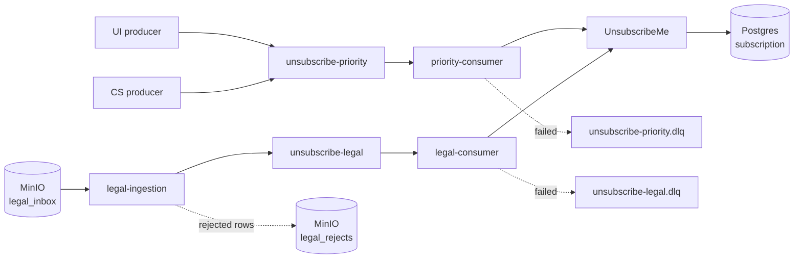

# Operational Plane — Design

Why the operational path looks the way it does. What it is and how to run it is
in the [README](../README.md); this document is the reasoning behind it.

The job of this plane: take an unsubscribe request from any of the three
sources and make sure it is applied by the external UnsubscribeMe service —
quickly for the UI, reliably for everyone.

---

## Diagram

---

## Two topics, split by SLA rather than by source

UI and Customer Success need near-real-time delivery. A Legal batch of a million
rows does not. On a shared topic that batch sits in front of a fresh UI click and
breaks its latency — the classic head-of-line problem.

The obvious cheaper fix is one topic with a rate limit on the Legal producer, and
it does solve the queueing. It was rejected for three reasons:

- **Fault isolation.** A poisoned Legal batch, or a Legal consumer stuck in a
  retry cycle, would become a latency incident on the UI path.
- **Independent scaling.** A nightly batch is drained by scaling the Legal
  deployment, without touching the priority consumer.
- **Independent tuning.** Priority is tuned for latency, Legal for throughput.
  One topic forces one compromise on both.

The rate limit itself would also become a parameter nobody dares to change: it
trades Legal throughput against UI risk in a single number.

Customer Success rides on the priority topic even though the task only demands
near-real-time for the UI. If an agent tells a caller "done, you are
unsubscribed", the change has to be real by the time the call ends. The volume is
irrelevant here; the expectation is what sets the SLA.

## One business logic, two deployments

`priority-consumer` and `legal-consumer` are the same image with different
environment variables: topic, consumer group, DLQ topic. What differs between
the paths is delivery and tuning, not the meaning of an unsubscribe.

Separate consumer groups are what makes the two paths independent — each keeps
its own offsets and its own lag.

## Delivery semantics: at-least-once

Exactly-once was not on the table. Kafka's exactly-once semantics cover
consume-transform-produce *within* Kafka; here the terminal step is an HTTP call
to an external service, which no Kafka transaction can include. With an external
side effect the honest options are at-least-once with an idempotent receiver, or
at-most-once with data loss.

For a consent record, losing a request is unacceptable and applying it twice is
harmless. So: at-least-once, and idempotency becomes a hard requirement rather
than an optimisation.

The order is therefore fixed: call UnsubscribeMe, then commit the offset. A crash
in between replays one event into an idempotent endpoint. Committing first would
silently drop an unsubscribe.

Three separate layers absorb duplicates:

| Layer | Cause | Handled by |
|---|---|---|
| Producer | retry after a lost acknowledgement | `enable.idempotence=true` |
| Consumer | crash between the call and the commit | idempotent UPSERT downstream |
| Business | UI, then Customer Success, then Legal for the same subscription | the same UPSERT |

The third is not corrupt data. Those are three legitimate independent commands to
reach the same state, and the platform must converge them rather than reject them.

## Where idempotency lives

In UnsubscribeMe's own database, as an UPSERT on `(user_id, writer_id)` — not in
Kafka, not in consumer memory.

`unsubscribed_at` is preserved from the first request that actually changed the
state: a duplicate arriving from a Legal batch two weeks later must not rewrite
when the reader unsubscribed. That timestamp is what reporting will use.

The transition is monotonic, so replay order does not affect the final state:
reprocessing a topic from the beginning converges to the same rows.

The service answers with an `outcome` — `created` or `unchanged` — which makes
the guarantee observable instead of assumed.

## Durability of the write path

Topics are `replication_factor=3` with `min.insync.replicas=2`, producers use
`acks=all` and idempotence, and unclean leader election is off.

`acks=all` means "acknowledged by all replicas *currently in sync*", so its
strength is set by `min.insync.replicas`. Two numbers follow from the pair:
failures tolerated without blocking writes is `RF − minISR`, and failures
tolerated without losing an acknowledged write is `minISR − 1`. RF=3 / minISR=2
gives one of each — a broker can die without stopping producers, and an
acknowledged unsubscribe survives its death.

RF=2 / minISR=1, the earlier setting, was the trap: the ISR can shrink to the
leader alone, the write is still acknowledged, and a broker failure loses it.
`acks=all` degrades into `acks=1` exactly when the guarantee matters. The
alternatives with minISR equal to RF are the opposite failure: strict durability
with zero write availability, where the first restart stops all producers.

The message key is `user_id:writer_id`. Kafka guarantees order only within a
partition, and the partition is chosen by hashing the key, so all events for one
subscription are handled sequentially by one consumer instance *within that
topic*. The same subscription can still appear on both topics at once — a UI
click and a Legal batch — and there is no ordering between them. Correctness does
not depend on it — unsubscribe is monotonic — but it removes concurrent writers
for the same row for free, and the key space is large enough not to create a hot
partition.

## Legal ingestion

Legal is the one source whose contract is not assumed. UI and Customer Success
are services expected to emit the canonical event; Legal sends a file, and the
file is parsed here — so its row-level validation is inside the boundary.

A row that cannot become an event (empty user, missing writer, unparsable date,
wrong column count) is written to a reject file with its line number and reason.
Individual bad rows do not discard the batch; a file that cannot be read at all is
set aside without a row-by-row attempt. Header validation is not implemented: the
first line is skipped, so a file with the right shape but wrong column names is
processed as if the columns were correct.

Rejects are not the DLQ. A reject never reached Kafka; a dead-lettered message
was published and could not be processed afterwards. Different stage, different
mechanism.

The ingestion job runs once and exits, rather than polling. The source is
batch-shaped, and in production this is a job triggered by a file arriving.
Idempotency is per file: a processed file moves aside, and a second run skips it.
The file itself is only considered processed once every event it produced has
been acknowledged by Kafka.

Everything that knows where files physically are lives in one class. Locally
that is object storage under a prefix; in production the same interface points at
an S3 bucket. Two details of object storage leak into the design and are handled
rather than hidden: "moving" a file is a copy plus a delete and is not atomic, so
a crash in between leaves it in both places — which the per-file idempotency
absorbs — and listing gives no ordering guarantee.

## Failure handling

Failures are split by whether a retry could plausibly help:

| Outcome | Class | Action |
|---|---|---|
| 2xx | success | commit |
| 4xx other than 408/429 | permanent | straight to the DLQ |
| 408, 429, 5xx, timeout | transient | bounded retry, then the DLQ |
| undecodable bytes | permanent | straight to the DLQ, as received |

Transient failures get three attempts with a growing pause (0.5s, 1s, 2s). The
budget is deliberately small: these retries block the partition, so they buy
resilience against a blip and nothing more.

What survives the budget is copied to a dead-letter topic — one per source topic,
so a poisoned Legal batch can never contaminate the priority path — and the
offset is committed. Not committing would turn one unprocessable message into an
outage for everything behind it.

The DLQ producer writes the original bytes verbatim, with the reason in the
headers. A message that failed *because* it does not match the schema has to land
there too, and an encoder would reject it a second time.

TBD: strengthen DLQ publication confirmation so the source Kafka offset is committed
only after DLQ delivery is positively confirmed. The current design intent is correct,
but this failure edge should be hardened before production use.

**The known gap.** Bounded retries protect the queue from one bad message; they
do not protect it from a downstream that is down for everyone. With a total
outage, every event in the topic is parked in about a second and a half each, and
the DLQ becomes a copy of the stream rather than a place for exceptions. The
missing piece is a circuit breaker: after N consecutive failures, stop consuming
and wait for the service to return. It is not implemented, and it is the first
thing to add.

## What is assumed rather than built

- **The event contract for UI and Customer Success.** Both are expected to emit
  the canonical event. Schema Registry enforces the *shape* of what is
  published — a producer cannot send a record that does not match the schema —
  but not its meaning: a schema-valid event with a nonsensical timestamp passes.
- **Resubscription.** Unsubscribe is monotonic here; the reverse operation
  belongs to another service.
- **UnsubscribeMe itself.** The stub stands in for a third-party service. In
  production its database is not reachable, so idempotency would rest on its own
  contract — verified, not assumed — or on a dedup table on our side.
